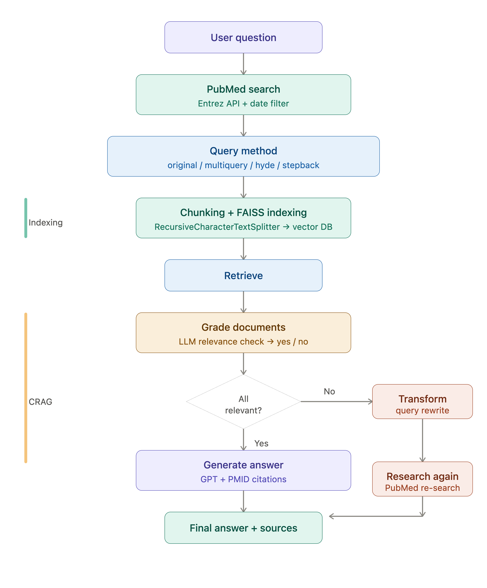

# MedPub Rag Answering Chatbot

## Project Summary
This project is a RAG-based medical question-answering system that uses only PubMed papers to reduce AI hallucinations and provide reliable medical information. Every answer includes the PMID, author, and publication year as evidence. It also uses a CRAG (Corrective RAG) pipeline to evaluate the relevance of retrieved papers and automatically re-search when irrelevant results are found. In addition, the system improves retrieval accuracy by applying multiple query strategies such as Multi-Query, HyDE, and Step-Back.

## Flow

## Methodology 
- Step 1. PubMed Search
  - Search PubMed in real time using the Entrez API. Retrieve relevant papers based on the user's question.
  
- Step 2. Query Strategy Select one of the following retrieval strategies to improve search quality:
  - Original – Search using the original question.
  - Multi-Query – Generate multiple query variations with an LLM.
  - HyDE – Generate a hypothetical document to improve semantic retrieval.
  - Step-Back – Reformulate the question into a higher-level concept before searching.
    
- Step 3. Document Indexing
  - Split retrieved abstracts into chunks. Convert chunks into embeddings. Store embeddings in a FAISS vector database.
  
- Step 4. Retrieval
  - Perform similarity search on the FAISS index. Retrieve the most relevant documents.

- Step 5. Document Grading (CRAG)
  - Evaluate the relevance of retrieved documents using an LLM. Trigger a new search if the retrieved documents are insufficient or irrelevant.

- Step 6. Query Refinement
  - Rewrite the query based on the grading results. Re-search PubMed and retrieve improved documents when necessary.

- Step 7. Answer Generation
  - Generate the final answer using the retrieved evidence. Include PMID, author, and publication year for every reference.
  - Return "Insufficient evidence" when reliable evidence is unavailable to reduce hallucinations.

## Tech Stack

| Category | Technology |
|----------|------------|
| **LLM** | GPT-4o-mini (OpenAI) |
| **Framework** | LangChain, LangGraph (CRAG) |
| **Vector Database** | FAISS |
| **Embeddings** | OpenAI Embeddings |
| **Data Source** | PubMed API (Entrez) |
| **Frontend** | Streamlit |

## References
- [Learn RAG From Scratch – Python AI Tutorial from a LangChain Engineer](https://youtu.be/sVcwVQRHIc8?si=oqVIXYPKKFFO18wy)
